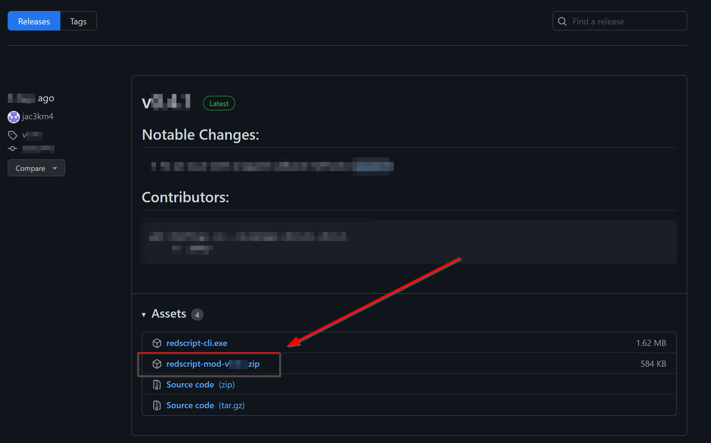
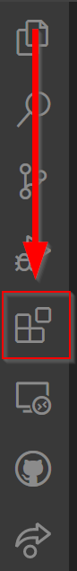
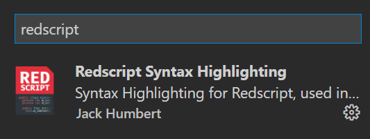
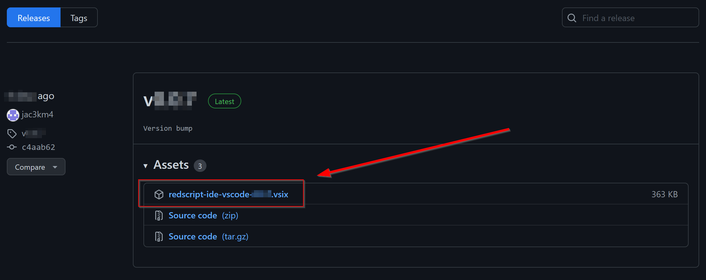
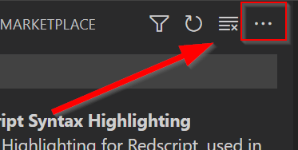
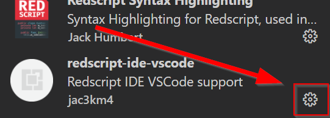
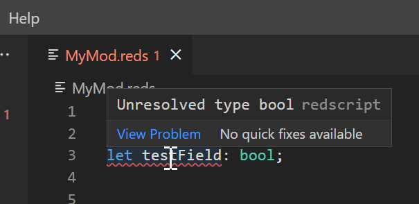

# Setting up Redscript and VSCode

Created by [HJHughJanus](https://github.com/HJHughJanus) on [github](https://github.com/jac3km4/redscript/discussions/66), moved here for better maintainability

## 1. Install redscript

1. Download redscript from [github](https://github.com/jac3km4/redscript/releases):

<figure><figcaption></figcaption></figure>

The zip file will contain the following folders:&#x20;

```
- engine
- r6
```

2. Extract it **directly** into your [Cyberpunk 2077](#user-content-fn-1)[^1] directory, so that the folders merge with the ones already there.
3. Start the game so that redscript can set itself up.
4. Check the folder `Cyberpunk 2077\r6\logs` : if redscript has done its thing, you will now see a file named `redscript_rCURRENT.log`&#x20;

You can now put your redscript mods into `Cyberpunk 2077\r6\scripts` and they will be automatically loaded when the game starts.

## 2. Setting up VSCode

1. Download and install [VSCode](https://code.visualstudio.com/).
2. After starting it, click on the Extensions icon in the left menu bar:

<figure><figcaption></figcaption></figure>

3. Search for `redscript` and install the `Redscript Syntax Highlighting` extension. Do not close the tab yet.

<figure><figcaption></figcaption></figure>

4. Download the redscript extension from [github](https://github.com/jac3km4/redscript-ide-vscode/releases):

<figure><figcaption></figcaption></figure>

5. In VSCode, click the … symbol in the topright of the extension manager and select `Install from VSIX…:`

<figure><figcaption></figcaption></figure>

6. Navigate the file picker to your downloads folder and install the file from step 4.
7. Your extension manager will now show both addons as installed. **If it does not,** restart VSCode.
8. Click on the cog menu next to redscript-ide-vscode:

<figure><figcaption></figcaption></figure>

8. Set up the path to your cyberpunk install in VS Code preferences.

<figure><figcaption></figcaption></figure>

9. Save the settings

## 3. Testing the tools


You need to restart VSCode before the redscript language server will start working


1. Create a mod development folder somewhere (example: `D:\Cyberpunk\redscript_modding`)
2. Inside the folder, create a plain text file with a `.reds` extension (e.g. `MyMod.reds`)
3. Open VSCode and click `Open Folder`, then point it at your mod development folder from step 1
4. On the left, you should see the file you created in step 2. Open it and paste the following (incorrect) code snippet:

```swift
//add field to NPC class
@addField(NPCPuppet)
let testField: bool;
```

5. Save the file (Hotkey: `Ctrl+S`).&#x20;
6. You should see an error, because `bool` should be `Bool`.&#x20;
7. Hover your cursor over the error, you should see something like this:

<figure><figcaption></figcaption></figure>

8. Correct the code:

```swift
//add field to NPC class
@addField(NPCPuppet)
let testField: Bool;
```

9. Save again — everything should work now.

If you want to make a redscript mod, you can check out [how-to-create-a-hook](../language/intro/how-to-create-a-hook/ "mention") (originally by [HJHughJanus](https://github.com/HJHughJanus) on github)

[^1]: The place where you installed the game. You can get there by selecting "Browse Local Files" (or the equivalent option) in Steam/Epic/GOG.
