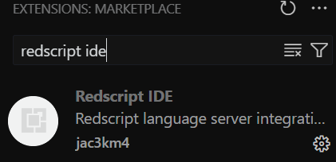

# Setting up Redscript and VSCode

Created by [HJHughJanus](https://github.com/HJHughJanus) on [github](https://github.com/jac3km4/redscript/discussions/66), moved here for better maintainability

## 1. Install redscript

1. Download redscript from [github](https://github.com/jac3km4/redscript/releases):

<figure><figcaption></figcaption></figure>

The zip file will contain the following folders:&#x20;

```
- engine
- r6
```

2. Extract it **directly** into your [Cyberpunk 2077](#user-content-fn-1)[^1] directory, so that the folders merge with the ones already there.
3. Start the game so that redscript can set itself up.
4. Check the folder `Cyberpunk 2077\r6\logs` : if redscript has done its thing, you will now see a file named `redscript_rCURRENT.log`&#x20;

You can now put your redscript mods into `Cyberpunk 2077\r6\scripts` and they will be automatically loaded when the game starts.

## 2. Setting up VSCode

1. Download and install [VSCode](https://code.visualstudio.com/).
2. After starting it, click on the Extensions icon in the left menu bar:

<figure><figcaption></figcaption></figure>

3. Search for `redscript ide` and install the `Redscript IDE` extension.


<div align="center">

<figure><figcaption></figcaption></figure>

</div>

4. Click on the cog menu next to redscript-ide-vscode:
5. Set up the path to your cyberpunk install in VS Code preferences.

<figure><figcaption></figcaption></figure>

6. Save the settings

## 3. Testing the tools


You need to restart VSCode before the redscript language server will start working


1. Create a mod development folder somewhere (example: `D:\Cyberpunk\redscript_modding`)
2. Inside the folder, create a plain text file with a `.reds` extension (e.g. `MyMod.reds`)
3. Open VSCode and click `Open Folder`, then point it at your mod development folder from step 1
4. On the left, you should see the file you created in step 2. Open it and paste the following (incorrect) code snippet:

```swift
//add field to NPC class
@addField(NPCPuppet)
let testField: bool;
```

5. Save the file (Hotkey: `Ctrl+S`).&#x20;
6. You should see an error, because `bool` should be `Bool`.&#x20;
7. Hover your cursor over the error, you should see something like this:

<figure><figcaption></figcaption></figure>

8. Correct the code:

```swift
//add field to NPC class
@addField(NPCPuppet)
let testField: Bool;
```

9. Save again — everything should work now.

If you want to make a redscript mod, you can check out [how-to-create-a-hook](../language/intro/how-to-create-a-hook/ "mention") (originally by [HJHughJanus](https://github.com/HJHughJanus) on github)

## 4. Bundle with red-cli


This step is optional. You might find this tool helpful to avoid repetitive tasks.


`red-cli` is command line interface tool to improve your experience as a scripting modder. It allows you to run commands from a terminal to quickly install your scripts in game folder. It is also convenient to make an archive with your scripts, ready to release to users on Nexus Mod.

You can find [red-cli](https://github.com/rayshader/cp2077-red-cli) on GitHub to download and install it on your system. You can then follow its README, it should explain everything you need to know to use it.

As an example, lets say your project (Cocktail · v0.1.0) contains the following scripts:

```sh
Cocktail/
|-- red.config.json                // Project's configuration, see README.
|-- scripts/
    |-- FruitCocktail.reds
    |-- Utils.reds
    |-- Data/
        |-- Fruit.reds
        |-- Banana.reds
    |-- Services/
        |-- CocktailService.reds
    |-- Extensions/
        |-- PlayerPuppet.reds
        |-- ItemObject.reds
```

If you run the command `red-cli pack` in a terminal, it will bundle scripts and output an archive like this:

```sh
Cocktail/
|-- Cocktail-v0.1.0.zip
    |-- r6/
        |-- scripts/
            |-- Cocktail/
                |-- Cocktail.reds
                |-- Cocktail.Global.reds
                |-- Cocktail.Data.reds
                |-- Cocktail.Services.reds
                |-- Cocktail.Extensions.reds
```

It helps quickly prepare your mod to release it. It also reduce the amount of scripts by merging them per module (see [module feature](../language/language-features/modules.md)). When the code is in the global scope (no module statement), it will merge scripts in `<name>.Global.reds`, with this example, in `Cocktail.Global.reds`.

If you have questions or feedback regarding this tool, please reach out in [red-cli](https://app.gitbook.com/s/BebXhPyeIAEOE4iqaLDr/) channel on Discord.

[^1]: The place where you installed the game. You can get there by selecting "Browse Local Files" (or the equivalent option) in Steam/Epic/GOG.
