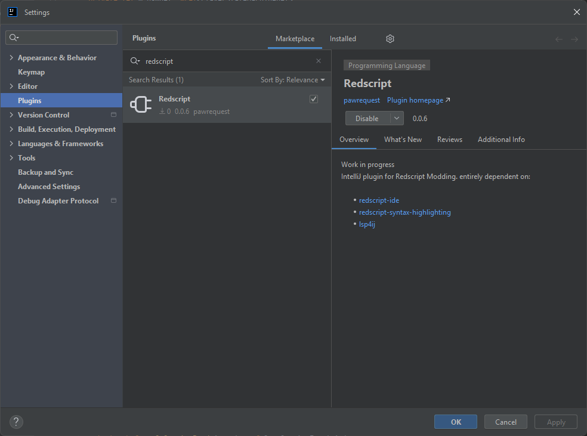
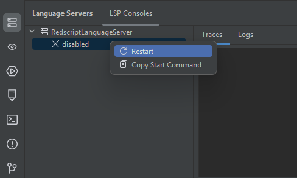
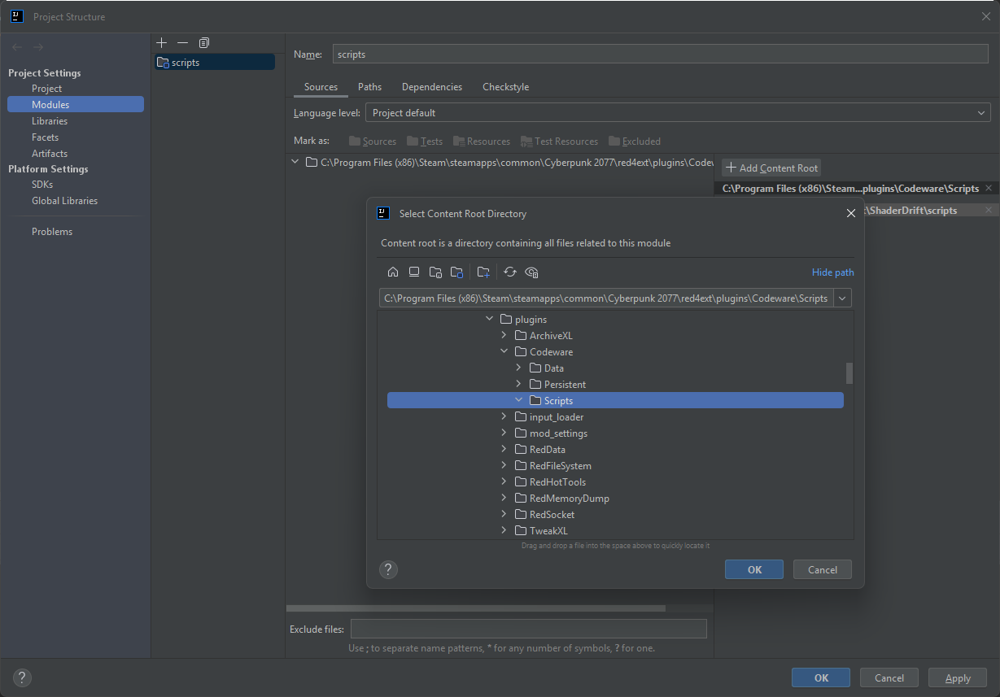

# Setup for JetBrains IDEs


This plugin is currently a work in progress. Some errors are already known and it might take time to fix them. Feel free to check [issues](https://github.com/pawrequest/redscript-intellij/issues), add new one or contribute to improve this plugin.


In this guide, I'll be using IntelliJ but the plugin works with any other JetBrains IDE like Pycharm / Webstorm / etc.

Please read through the entire guide first. If you still have issues to setup your environment, feel free to come and ask on Discord in this [dedicated forum](https://discord.com/channels/717692382849663036/1345360476036661353).

## Setup redscript plugin

Open IntelliJ and create a blank project for now. Open **Settings** (CTRL + ALT + S) and select **Plugins**. In the **Marketplace** tab, search for `redscript`. It will show you the plugin made by pawrequest ([GitHub](https://github.com/pawrequest/redscript-intellij)). Select and install it. You'll need to restart IntelliJ to activate the plugin:

<figure><figcaption><p>Showcase IDE popup to install Redscript plugin</p></figcaption></figure>

After IntelliJ restarted, go to **Settings** > **Tools** > **Redscript**. It will show you a field in the right panel.

Click on **Browse...** (at the bottom) and select game's directory (e.g. `C:/Program Files (x86)/Steam/steamapps/common/Cyberpunk 2077`).


This step is required to let the plugin and its Language Server know where to look for game scripts definitions.


You might need to restart the Language Server after changing this setting. You can find Redscript Language Server and restart it like shown below:

<figure><figcaption><p>Showcase how to restart Redscript Language Server</p></figcaption></figure>

If you have an issue, please do check this view.

In **Traces** tab, any errors related to the plugin will be visible here. You can copy/paste them to provide useful logs to help the author resolve your issue.

In **Logs** tab, any errors related to Redscript Language Server will be visible here. These are not directly related to the JetBrains plugin. But they could provide useful information to help resolve an issue.

## Check plugin is working

Create a new file in your blank project with `.reds` extension (e.g. `Dummy.reds`). It should be showing the official icon of [redscript](https://github.com/jac3km4/redscript?tab=readme-ov-file#redscript). Write the following snippet of code:

```swift
// Simple test
module Awesome

public class SimpleTest extends ScriptableSystem {

  /* Ain't this great?! */
  public func Chat(msg: String) {
    FTLog(s"Says \(msg)");
    let test = GoToDeclaration.CtrlClick();
    
    if test == true {
      FTLog("Yes");
    } else {
      FTLog("No");
    }
    let gi = GetGameInstance();
    let cameraSystem: wref<CameraSystem> = gi.GetCameraSystem();
    let ratio: Float = cameraSystem.GetAspectRatio();

    FTLog(s"camera ratio: \(ratio)");
  }

}

public class GoToDeclaration {

  public static func CtrlClick() -> Bool {
    FTLog("CTRL + CLICK should redirect you.");
    FTLog("You can test it by writing this class in another file.");
    return true;
  }

}
```

You should be able to mouse hover functions and go to declarations. It should also provide auto-completion (this feature is not perfect yet and depends on Redscript Language Server).

## Add dependencies to your project

You'll need to know one last step to be fully prepared to work on Redscript projects. Currently, the Language Server will not know about scripts from other mods. For example, if you want to use [Codeware](https://github.com/psiberx/cp2077-codeware?tab=readme-ov-file#codeware), it will not be recognized as-is.

Open **Project structure...** (CTRL + ALT + SHIFT + S). In **Project Settings** select **Modules**. Click on button **+ Add Content Root** to open a popup and select where Codeware's scripts are installed in your environment (e.g. `<game>\red4ext\plugins\Codeware\Scripts`):

<figure><figcaption><p>Showcase how to add scripts of a dependency</p></figcaption></figure>

Validate changes and it will now provide syntax highlighting, auto-completion and go to declaration features for Codeware. You can repeat this step for any other mods you'd like to depend on, for example ArchiveXL / TweakXL / etc.


As of v0.0.6, Codeware is not correctly handled, mostly due to [this issue](https://github.com/pawrequest/redscript-intellij/issues/10) regarding annotations like `@addField` and `@wrapMethod`.

